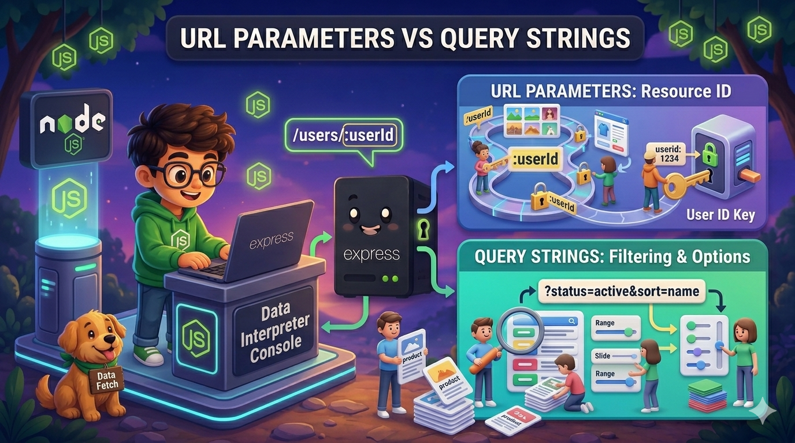
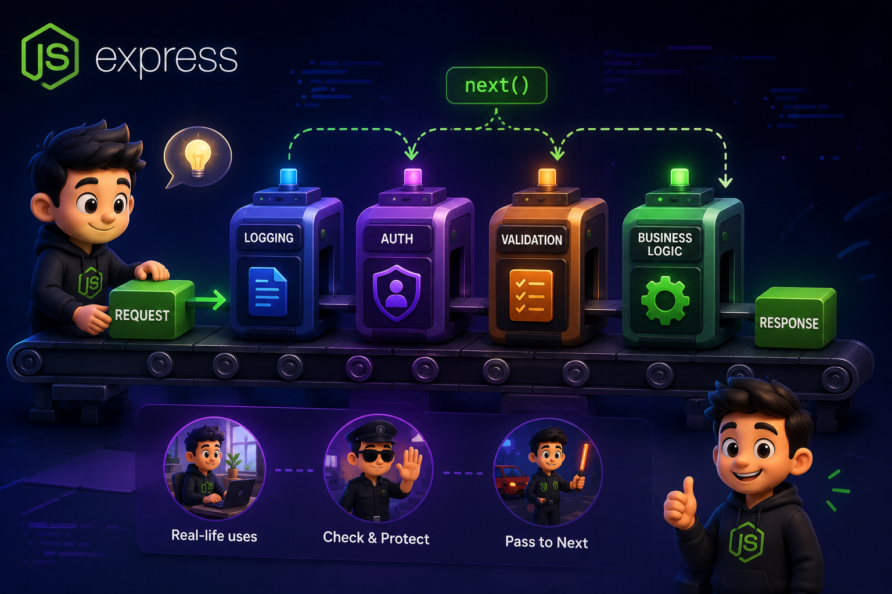
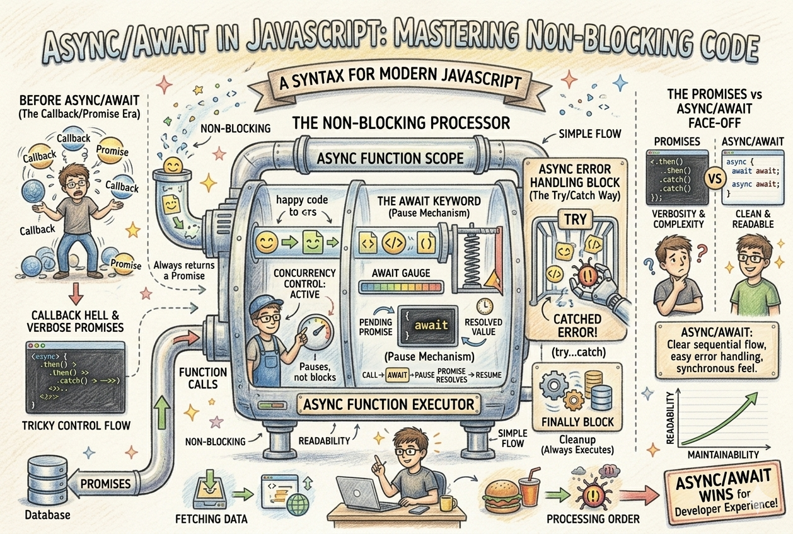
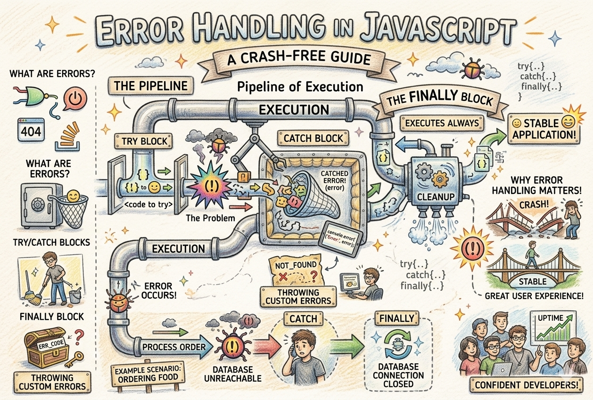
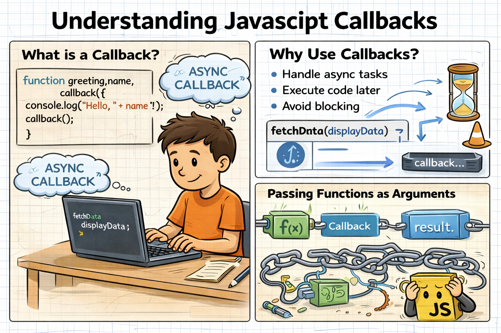
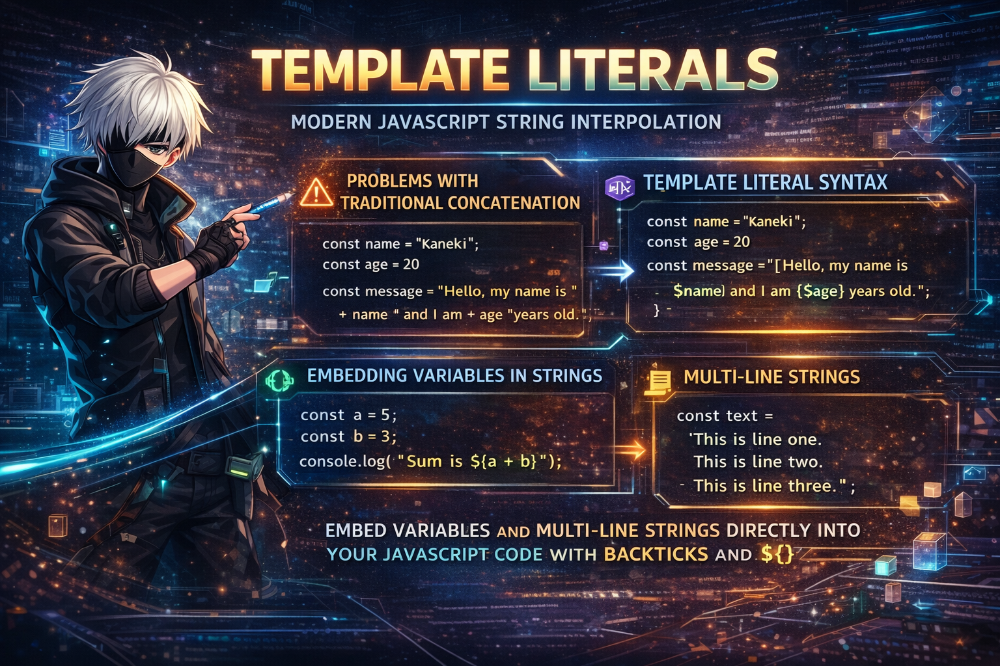
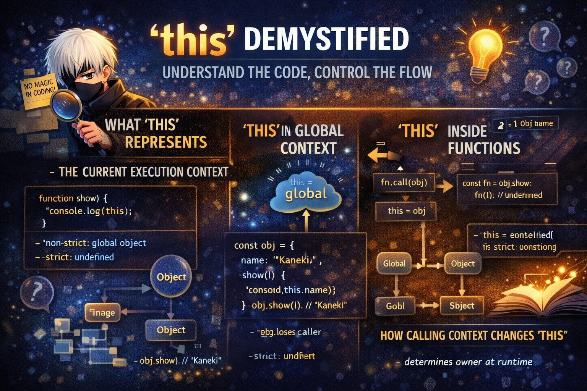

<a href="https://hashnode.com/@prakash-devx">
  <h1 align="center">Blogs</h1>
</a>

  Showcasing my journey of learning through reading, understanding and writing blogs

  
  
  

 

### [URL Parameters vs Query Strings in Express.js](https://js-blogs.hashnode.dev/url-parameters-vs-query-strings-in-express-js)

  <a href="https://js-blogs.hashnode.dev/url-parameters-vs-query-strings-in-express-js">
      

      
    

  </a>

 

### [Creating Routes and Handling Requests with Express](https://js-blogs.hashnode.dev/creating-routes-and-handling-requests-with-express)

  <a href="https://js-blogs.hashnode.dev/creating-routes-and-handling-requests-with-express">
      

      
    

  </a>

 

### [What is Middleware in Express and How It Works](https://js-blogs.hashnode.dev/what-is-middleware-in-express-and-how-it-works)

  <a href="https://js-blogs.hashnode.dev/what-is-middleware-in-express-and-how-it-works">
      

      
    

  </a>

 

### [JWT Authentication in Node.js Explained Simply](https://js-blogs.hashnode.dev/jwt-authentication-in-node-js-explained-simply)

  <a href="https://js-blogs.hashnode.dev/jwt-authentication-in-node-js-explained-simply">
      

      
    

  </a>

 

### [Sessions vs JWT vs Cookies: Understanding Authentication Approaches](https://js-blogs.hashnode.dev/sessions-vs-jwt-vs-cookies-understanding-authentication-approaches)

  <a href="https://js-blogs.hashnode.dev/sessions-vs-jwt-vs-cookies-understanding-authentication-approaches">
      

      
    

  </a>

 

### [REST API Design Made Simple with Express.js](https://js-blogs.hashnode.dev/rest-api-design-made-simple-with-express-js)

  <a href="https://js-blogs.hashnode.dev/rest-api-design-made-simple-with-express-js">
      

      
    

  </a>

 

### [Setting Up Your First Node.js Application Step-by-Step](https://js-blogs.hashnode.dev/setting-up-your-first-node-js-application-step-by-step)

  <a href="https://js-blogs.hashnode.dev/setting-up-your-first-node-js-application-step-by-step">
      

      
    

  </a>

 

### [How Node.js Handles Multiple Requests with a Single Thread](https://js-blogs.hashnode.dev/how-node-js-handles-multiple-requests-with-a-single-thread)

  <a href="https://js-blogs.hashnode.dev/how-node-js-handles-multiple-requests-with-a-single-thread">
      

      
    

  </a>

 

### [The Node.js Event Loop Explained](https://js-blogs.hashnode.dev/the-node-js-event-loop-explained)

  <a href="https://js-blogs.hashnode.dev/the-node-js-event-loop-explained">
      

      
    

  </a>

 

### [Blocking vs Non-Blocking Code in Node.js](https://js-blogs.hashnode.dev/blocking-vs-non-blocking-code-in-node-js)

  <a href="https://js-blogs.hashnode.dev/blocking-vs-non-blocking-code-in-node-js">
      

      
    

  </a>

 

### [Why Node.js is Perfect for Building Fast Web Applications](https://js-blogs.hashnode.dev/why-node-js-is-perfect-for-building-fast-web-applications)

  <a href="https://js-blogs.hashnode.dev/why-node-js-is-perfect-for-building-fast-web-applications">
      

      
    

  </a>

 

### [What is Node.js? JavaScript on the Server Explained](https://js-blogs.hashnode.dev/what-is-node-js-javascript-on-the-server-explained)

  <a href="https://js-blogs.hashnode.dev/what-is-node-js-javascript-on-the-server-explained">
      

      
    

  </a>

 

### [Map and Set in JavaScript](https://js-blogs.hashnode.dev/map-and-set-in-javascript)

  <a href="https://js-blogs.hashnode.dev/map-and-set-in-javascript">
      

      
    

  </a>

 

### [Destructuring in JavaScript](https://js-blogs.hashnode.dev/destructuring-in-javascript)

  <a href="https://js-blogs.hashnode.dev/destructuring-in-javascript">
      

      
    

  </a>

 

### [Async Code in Node.js: Callbacks and Promises](https://js-blogs.hashnode.dev/async-code-in-node-js-callbacks-and-promises)

  <a href="https://js-blogs.hashnode.dev/async-code-in-node-js-callbacks-and-promises">
      

      
    

  </a>

 

### [JavaScript Promises Explained for Beginners](https://js-blogs.hashnode.dev/javascript-promises-explained-for-beginners)

  <a href="https://js-blogs.hashnode.dev/javascript-promises-explained-for-beginners">
      

      
    

  </a>

 

### [Synchronous vs Asynchronous JavaScript](https://js-blogs.hashnode.dev/synchronous-vs-asynchronous-javascript)

  <a href="https://js-blogs.hashnode.dev/synchronous-vs-asynchronous-javascript">
      

      
    

  </a>

 

### [Linux File System : Internals You Should Know](https://js-blogs.hashnode.dev/linux-file-system-internals-you-should-know)

  <a href="https://js-blogs.hashnode.dev/linux-file-system-internals-you-should-know">
      

      
    

  </a>

 

### [Async/Await in JavaScript: Writing Cleaner Asynchronous Code](https://js-blogs.hashnode.dev/async-await-in-javascript-writing-cleaner-asynchronous-code)

  <a href="https://js-blogs.hashnode.dev/async-await-in-javascript-writing-cleaner-asynchronous-code">
      

      
    

  </a>

 

### [Error Handling in JavaScript: Try, Catch, Finally](https://js-blogs.hashnode.dev/error-handling-in-javascript-try-catch-finally)

  <a href="https://js-blogs.hashnode.dev/error-handling-in-javascript-try-catch-finally">
      

      
    

  </a>

 

### [Spread vs Rest Operators in JavaScript](https://js-blogs.hashnode.dev/spread-vs-rest-operators-in-javascript)

  <a href="https://js-blogs.hashnode.dev/spread-vs-rest-operators-in-javascript">
      

      
    

  </a>

 

### [String Polyfills and Common Interview Methods in JavaScript](https://js-blogs.hashnode.dev/string-polyfills-and-common-interview-methods-in-javascript)

  <a href="https://js-blogs.hashnode.dev/string-polyfills-and-common-interview-methods-in-javascript">
      

      
    

  </a>

 

### [The new Keyword in JavaScript](https://js-blogs.hashnode.dev/the-new-keyword-in-javascript)

  <a href="https://js-blogs.hashnode.dev/the-new-keyword-in-javascript">
      

      
    

  </a>

 

### [Callbacks in JavaScript: Why They Exist](https://js-blogs.hashnode.dev/callbacks-in-javascript-why-they-exist)

  <a href="https://js-blogs.hashnode.dev/callbacks-in-javascript-why-they-exist">
      

      
    

  </a>

 

### [Template Literals in JavaScript](https://js-blogs.hashnode.dev/template-literals-in-javascript)

  <a href="https://js-blogs.hashnode.dev/template-literals-in-javascript">
      

      
    

  </a>

 

### [Array Flatten in JavaScript](https://js-blogs.hashnode.dev/array-flatten-in-javascript)

  <a href="https://js-blogs.hashnode.dev/array-flatten-in-javascript">
      

      
    

  </a>

 

### [JavaScript Modules: Import and Export Explained](https://js-blogs.hashnode.dev/javascript-modules-import-and-export-explained)

  <a href="https://js-blogs.hashnode.dev/javascript-modules-import-and-export-explained">
      

      
    

  </a>

 

### [Understanding the this Keyword in JavaScript](https://js-blogs.hashnode.dev/understanding-the-this-keyword-in-javascript)

  <a href="https://js-blogs.hashnode.dev/understanding-the-this-keyword-in-javascript">
      

      
    

  </a>
 

### [Why Version Control Exists: The Pendrive Problem](https://life-of-developers-before-git.hashnode.dev/why-version-control-exists-the-pendrive-problem)

  <a href="https://life-of-developers-before-git.hashnode.dev/why-version-control-exists-the-pendrive-problem">
      

      
    

  </a>

 

### [Git for Beginners: Basics and Essential Commands](https://why-git-dominates-version-control.hashnode.dev/git-for-beginners-basics-and-essential-commands)

  <a href="https://why-git-dominates-version-control.hashnode.dev/git-for-beginners-basics-and-essential-commands">
      

      
    

  </a>

 

### [How Git Works Behind the Scenes and the .git Folder](https://how-git-tracks-changes-internally.hashnode.dev/how-git-works-behind-the-scenes-and-the-git-folder)

  <a href="https://how-git-tracks-changes-internally.hashnode.dev/how-git-works-behind-the-scenes-and-the-git-folder">
      

      
    

  </a>

 

### [The Role of Network Devicesl](https://role-of-network-devices.hashnode.dev/how-the-internet-reaches-our-home-the-role-of-network-devices)

  <a href="https://role-of-network-devices.hashnode.dev/how-the-internet-reaches-our-home-the-role-of-network-devices">
      

      
    

  </a>

 

### [DNS Record Types Explained](https://what-is-dns-and-record-types.hashnode.dev/dns-record-types-explained)

  <a href="https://what-is-dns-and-record-types.hashnode.dev/dns-record-types-explained">
      

      
    

  </a>

 

### [DNS Name Resolution Explained Using the dig Command](https://dns-resolution-using-dig.hashnode.dev/dns-name-resolution-explained-using-the-dig-command)

  <a href="https://dns-resolution-using-dig.hashnode.dev/dns-name-resolution-explained-using-the-dig-command">
      

      
    

  </a>

 

### [What is cURL and Why Programmers need cURL](https://why-every-programmer-should-know-curl.hashnode.dev/what-is-curl-and-why-programmers-need-curl)

  <a href="https://why-every-programmer-should-know-curl.hashnode.dev/what-is-curl-and-why-programmers-need-curl">
      

      
    

  </a>

 

### [TCP vs UDP: When to Use What, and How TCP Relates to HTTP](https://tcp-vs-udp-use-cases-explained.hashnode.dev/tcp-vs-udp-when-to-use-what-and-how-tcp-relates-to-http)

  <a href="https://tcp-vs-udp-use-cases-explained.hashnode.dev/tcp-vs-udp-when-to-use-what-and-how-tcp-relates-to-http">
      

      
    

  </a>

 

### [TCP Working: 3-Way Handshake & Reliable Communication](https://tcp-handshake-and-reliable-transfer.hashnode.dev/tcp-working-3-way-handshake-and-reliable-communication)

  <a href="https://tcp-handshake-and-reliable-transfer.hashnode.dev/tcp-working-3-way-handshake-and-reliable-communication">
      

      
    

  </a>

 

### [How a Browser Works: A Beginner-Friendly Guide to Browser Internals](https://how-a-browser-works-behind-the-scenes.hashnode.dev/how-a-browser-works-a-beginner-friendly-guide-to-browser-internals)

  <a href="https://how-a-browser-works-behind-the-scenes.hashnode.dev/how-a-browser-works-a-beginner-friendly-guide-to-browser-internals">
      

      
    

  </a>

 

### [Understanding HTML Tags and Elements](https://html-basics-tags-and-elements.hashnode.dev/understanding-html-tags-and-elements)

  <a href="https://html-basics-tags-and-elements.hashnode.dev/understanding-html-tags-and-elements">
      

      
    

  </a>

 

### [CSS Selectors 101: Targeting Elements with Precision](https://css-selectors-101-precision-targeting.hashnode.dev/css-selectors-101-targeting-elements-with-precision)

  <a href="https://css-selectors-101-precision-targeting.hashnode.dev/css-selectors-101-targeting-elements-with-precision">
      

      
    

  </a>

 

### [Emmet for HTML: A Beginner’s Guide to Writing Faster Markup](https://emmet-for-html-write-faster-markup.hashnode.dev/emmet-for-html-a-beginners-guide-to-writing-faster-markup)

  <a href="https://emmet-for-html-write-faster-markup.hashnode.dev/emmet-for-html-a-beginners-guide-to-writing-faster-markup">
      

      
    

  </a>

 

### [Promises in JavaScript with Multiverse Stories](https://promises-in-js.hashnode.dev/promises-in-javascript-with-multiverse-stories)

  <a href="https://promises-in-js.hashnode.dev/promises-in-javascript-with-multiverse-stories">
      

      
    

  </a>

 

### [JavaScript Operators: The Building Blocks of Logic](https://js-blogs.hashnode.dev/javascript-operators-the-building-blocks-of-logic)

  <a href="https://js-blogs.hashnode.dev/javascript-operators-the-building-blocks-of-logic">
      

      
    

  </a>

 

### [Understanding Variables and Data Types in JavaScript](https://js-blogs.hashnode.dev/understanding-variables-and-data-types-in-javascript)

  <a href="https://js-blogs.hashnode.dev/understanding-variables-and-data-types-in-javascript">
      

      
    

  </a>

 

### [JavaScript Arrays 101](https://js-blogs.hashnode.dev/javascript-arrays-101)

  <a href="https://js-blogs.hashnode.dev/javascript-arrays-101">
      

      
    

  </a>

 

### [Array Methods You Must Know](https://js-blogs.hashnode.dev/array-methods-you-must-know)

  <a href="https://js-blogs.hashnode.dev/array-methods-you-must-know">
      

      
    

  </a>

 

### [Control Flow in JavaScript: If, Else, and Switch Explained](https://js-blogs.hashnode.dev/control-flow-in-javascript-if-else-and-switch-explained)

  <a href="https://js-blogs.hashnode.dev/control-flow-in-javascript-if-else-and-switch-explained">
      

      
    

  </a>

 

### [Arrow Functions in JavaScript: A Simpler Way to Write Functions](https://js-blogs.hashnode.dev/arrow-functions-in-javascript-a-simpler-way-to-write-functions)

  <a href="https://js-blogs.hashnode.dev/arrow-functions-in-javascript-a-simpler-way-to-write-functions">
      

      
    

  </a>

 

### [Function Declaration vs Function Expression: What’s the Difference?](https://js-blogs.hashnode.dev/function-declaration-vs-function-expression-what-s-the-difference)

  <a href="https://js-blogs.hashnode.dev/function-declaration-vs-function-expression-what-s-the-difference">
      

      
    

  </a>

 

### [The Magic of this, call(), apply(), and bind() in JavaScript](https://js-blogs.hashnode.dev/the-magic-of-this-call-apply-and-bind-in-javascript)

  <a href="https://js-blogs.hashnode.dev/the-magic-of-this-call-apply-and-bind-in-javascript">
      

      
    

  </a>

 

### [Understanding Object-Oriented Programming in JavaScript](https://js-blogs.hashnode.dev/understanding-object-oriented-programming-in-javascript)

  <a href="https://js-blogs.hashnode.dev/understanding-object-oriented-programming-in-javascript">
      

      
    

  </a>

 

### [Understanding Objects in JavaScript](https://js-blogs.hashnode.dev/understanding-objects-in-javascript)

  <a href="https://js-blogs.hashnode.dev/understanding-objects-in-javascript">
      

      
    

  </a>

 
